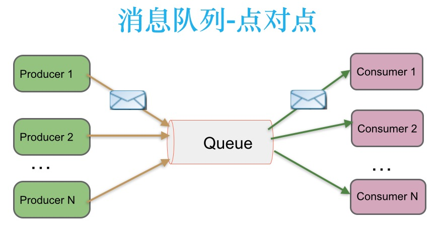

# Apache Kafka® 作为一个分布式的流式平台，这到底意味着什么？

## 消息队列分类：

### 点对点：

消息生产者生产消息发送到queue中，然后消息消费者从queue中取出并且消费信息。

* 消息被消费以后，queue不再有存储，所以消息消费者不可消费到已经被消费的消息
* Queue支持存在多个消费者，但是对一个消息而言，只会有一个消费者可以消费

### 发布/订阅：

消息生产者（发布）将消息发布到topic中，同时有多个消息消费者（订阅）消费该消息。和点对点方式不同，发布到topic的消息会被所有订阅者消费。

## 一个流平台有三个关键要素：

* Publish and subscribe to streams of records, similar to a message queue or enterprise messaging system.

    发布和订阅记录流，类似于消息队列或企业消息系统

* Store streams of records in a fault-tolerant durable way.

    存储记录流并能容错

* Process streams of records as they occur.

    即时处理记录流

## Kafka主要应用在两类场景

1. Building real-time streaming data pipelines that reliably get data between systems or applications

    建立实时流数据管道，可靠地在系统和应用之间获取传输数据

2. Building real-time streaming applications that transform or react to the streams of data

    建立实时流应用，能传输和响应数据流
    
3. 其他：活动跟踪、度量指标和日志记录、提交日志等

---

## Kafka相关概念

* Kafka is run as a cluster on one or more servers that can span multiple datacenters.

    Kafka 运行在单个或者多个服务器集群中，并且可以跨多个数据中心

* The Kafka cluster stores streams of records in categories called topics.

    kafka 集群存储数据流记录（record）按主题分类，称之为topics

* Each record consists of a key, a value, and a timestamp.

    每一个数据流记录（record）包括了一个key(键),value(值)和一个timestamp(时间戳)

---

## Kafka 有4个核心APIs

* The Producer API allows an application to publish a stream of records to one or more Kafka topics.

    Porducer API(生产者API)允许应用发布一个流记录到一个或多个kafka topics中

* The Consumer API allows an application to subscribe to one or more topics and process the stream of records produced to them.

    Consumer API(消费者API)允许应用订阅一个或多个topics并处理topics中的流记录(records)

* The Streams API allows an application to act as a stream processor, consuming an input stream from one or more topics and producing an output stream to one or more output topics, effectively transforming the input streams to output streams.

  Streams API(流API)允许一个应用表现为一个流处理器，消费从一个或多个topics得到的输入流，并产生一个输出流到一个或多个输出topics，即能有效的把输入流转变为输出流。

* The Connector API allows building and running reusable producers or consumers that connect Kafka topics to existing applications or data systems. For example, a connector to a relational database might capture every change to a table.

    Connector API(连接器API)允许构建并运行可重复使用的生产者或消费者,它们可以把kafka的topics连接到已存在的应用或数据系统中。例如，一个链接到关系数据库的kafka topics可能会捕获数据库表的任意变化

---

Kafka客户端和服务端之间的通信是建立在简单的、高效的、语言无关的TCP协议上的。此协议带有版本且向后兼容。我们为Kafka提供了Java客户端，但是客户端可以使用多种语言。

## Kafka的一些基本术语
### Topic
可以理解为一个队列，Kafka将消息种子（Feed）分门别类，每一类的消息称之为一个主题（Topic）

### Broker
已发布的消息保存在一组服务器中，称之为Kafka集群。集群中的每一个服务器都是一个代理(Broker)。消费者可以订阅一个或多个主题（topic），并从Broker拉数据，从而消费这些已发布的消息。

### Producer
消息生产者，就是向Kafka broker发消息的客户端

### Consumer
消息消费者，就是向Kafka broker取消息的客户端

### Consumer Group （CG）
这是kafka用来实现一个topic消息的广播（发给所有的consumer）和单播（发给任意一个consumer）的手段。一个topic可以有多个CG。topic的消息会复制（不是真的复制，是概念上的）到所有的CG，但每个CG只会把消息发给该CG中的一个consumer。如果需要实现广播，只要每个consumer有一个独立的CG就可以了。要实现单播只要所有的consumer在同一个CG。用CG还可以将consumer进行自由的分组而不需要多次发送消息到不同的topic。

### Partition
为了实现扩展性，一个非常大的topic可以分布到多个broker（即服务器）上，一个topic可以分为多个partition，每个partition是一个有序的队列。partition中的每条消息都会被分配一个有序的id（offset）。kafka只保证按一个partition中的顺序将消息发给consumer，不保证一个topic的整体（多个partition间）的顺序。

### Offset
Kafka的存储文件都是按照offset.kafka来命名，用offset做名字的好处是方便查找。例如你想找位于2049的位置，只要找到2048.kafka的文件即可。当然the first offset就是00000000000.kafka

## 主题和日志（Topics and Logs）

一个topic是一个数据流记录（records）的提供者。Kafka中的topics一般是多订阅者的，即一个Topic可以有0个,1个,多个Consumer消费者订阅。

对每一个 topick, kafka 集群维护如下的一个分区日志

Each partition is an ordered, immutable sequence of records that is continually appended to—a structured commit log. The records in the partitions are each assigned a sequential id number called the offset that uniquely identifies each record within the partition.

每个分区是一个有序,不可改变的序列records，它被不断追加一种结构化的操作日志。分区的records都分配了一个连续的id号叫做偏移量。偏移量唯一的标识在分区的每一条记录。

The Kafka cluster durably persists all published records—whether or not they have been consumed—using a configurable retention period. For example, if the retention policy is set to two days, then for the two days after a record is published, it is available for consumption, after which it will be discarded to free up space. Kafka's performance is effectively constant with respect to data size so storing data for a long time is not a problem.

kafka 集群使用一个可配置的保存期来持久的保存所有已经发布出去的records，不论这些records是否已经被消费掉。例如，如果保存的策略设置为两天，那么records发布出去的两天内可以消费,两天之后,这些records将被丢弃以腾出空间。kafka的性能是常数级别的，不论数据大小，所以能对数据存储很长一段时间。

In fact, the only metadata retained on a per-consumer basis is the offset or position of that consumer in the log. This offset is controlled by the consumer: normally a consumer will advance its offset linearly as it reads records, but, in fact, since the position is controlled by the consumer it can consume records in any order it likes. For example a consumer can reset to an older offset to reprocess data from the past or skip ahead to the most recent record and start consuming from "now".

实时上, 保留在每个消费者的基上的唯一元数据是每个消费的日志偏移或具体位置。这个偏移量有消费者控制：通常当消费者读取一个记录后会线性的增加他的偏移量。但是，事实上，由于位置是由消费者控制的，消费者是可以在任何次序消费records的。例如，一个消费者可以重新设置偏移量，忽略某些数据然后重新开始消费。

This combination of features means that Kafka consumers are very cheap—they can come and go without much impact on the cluster or on other consumers. For example, you can use our command line tools to "tail" the contents of any topic without changing what is consumed by any existing consumers.

kafka的这些特性意味着 kafka消费者可以方便的加入或者离开而不会对集群或者其它的消费者造成很大影响。例如，可以使用命令行工具去追踪任何topic的内容而不会改变这些内容，即使这些内容被其它消费者消费。

The partitions in the log serve several purposes. First, they allow the log to scale beyond a size that will fit on a single server. Each individual partition must fit on the servers that host it, but a topic may have many partitions so it can handle an arbitrary amount of data. Second they act as the unit of parallelism—more on that in a bit.

日志划分分区有多个目的。第一：当一个日志的规模超过单台的服务器时，这仍是可行的。每一个分区partition会适应服务器的大小，一个topic可能会有多个分区，所以kafka可以处理任意大小的数据。第二，对外表现成一个并行的统一单元

## 分布式(Distribution)

The partitions of the log are distributed over the servers in the Kafka cluster with each server handling data and requests for a share of the partitions. Each partition is replicated across a configurable number of servers for fault tolerance.

每个日志分区pariton被分布在Kafka集群服务器上，每个服务器都能处理分区的数据和请求。每个分区会被复制到其它服务器上，这是可配置的以方便容错处理。

Each partition has one server which acts as the "leader" and zero or more servers which act as "followers". The leader handles all read and write requests for the partition while the followers passively replicate the leader. If the leader fails, one of the followers will automatically become the new leader. Each server acts as a leader for some of its partitions and a follower for others so load is well balanced within the cluster.

每个分区都有一个服务器充当leader“领导者”，零个或多个服务器充当followers“追随者”。leader处理对分区所有的读写请求，followers就会被动复制这个leader。如果leader失败，其中一个follower会自动变成leader。每个服务器都充当某些分区的leader，并且每个分区有一些follower服务器，这对于集群来说是平衡的。

## Geo-Replication

Kafka MirrorMaker provides geo-replication support for your clusters. With MirrorMaker, messages are replicated across multiple datacenters or cloud regions. You can use this in active/passive scenarios for backup and recovery; or in active/active scenarios to place data closer to your users, or support data locality requirements.

## Producer (生产者)

Producers publish data to the topics of their choice. The producer is responsible for choosing which record to assign to which partition within the topic. This can be done in a round-robin fashion simply to balance load or it can be done according to some semantic partition function (say based on some key in the record). More on the use of partitioning in a second!

生产者推送数据到他们选择的topics。生产者负责选择哪个record分配到指定topics的哪个分区partion中。通过循环的方式可以简单地来平衡负载recors到分区上或可以根据一些语义分区函数来确定记录到哪个分区上（例如根据records的key进行划分）。

## Consumers (消费者)

Consumers label themselves with a consumer group name, and each record published to a topic is delivered to one consumer instance within each subscribing consumer group. Consumer instances can be in separate processes or on separate machines.

消费者们标识他们自己通过消费者组名称，每一条被推送到topics的record只被交付给订阅该topic的每一个消费者组。消费者可以在单独的实例流程或在不同的机器上

If all the consumer instances have the same consumer group, then the records will effectively be load balanced over the consumer instances.

如果所有的消费者实例都在同一个消费者组中，那么records将会有效地负载平衡给这些消费者实例

If all the consumer instances have different consumer groups, then each record will be broadcast to all the consumer processes.

如果所有的消费者实例在不同的消费者组中，那么每一条record将会被广播给所有的消费者处理

如上图，两台服务器构成一个Kafka集群，并且有4个分区（P0-P3），并切有两个消费者组，group A 有两个消费者实例， group B 有 四个消费者实例

更常见的是，topics会有一个小数量的消费者群。每个消费者群有很多消费者实例来保证可测性和容错性。这是个发布-订阅模式，只是订阅方是一个集群。

Kafka中消费的实现方式是“公平”的将分区分配给Consumer，每一个时刻分区都拥有它唯一的消费者。Consumer成员关系由Kafka协议动态维护。如果新的Consumer加入了分区，那么它会从这个分区其他的Consumer中分配走一部分分区；如果部分Consumer实例宕机，它的分区会被其他Consumer实例接管。

Kafka只保证同一个分区内record的顺序，而不能确保同一个topic的不同分区间数据的顺序。每个分区顺序结合按Key分配分区，这能满足大多数程序的需求。如果需要全局的顺序，可以使用只有一个分区的topic，这意味着每个group只能有一个Consumer实例（因为一个分区同一时刻只能被一份Consumer消费——多加的Consumer只能用于容错）。

## Multi-tenancy ( 多租户架构 )

You can deploy Kafka as a multi-tenant solution. Multi-tenancy is enabled by configuring which topics can produce or consume data. There is also operations support for quotas. Administrators can define and enforce quotas on requests to control the broker resources that are used by clients. For more information, see the **security documentation**.

## Guarantees

At a high-level Kafka gives the following guarantees:
　　

* Messages sent by a producer to a particular topic partition will be appended in the order they are sent. That is, if a record M1 is sent by the same producer as a record M2, and M1 is sent first, then M1 will have a lower offset than M2 and appear earlier in the log.
　　
消息被生产者发送到一个特定的主题分区，消息将以发送的顺序追加到这个分区上面。比如，如果M1和M2消息都被同一个消费者发送，M1先发送，M1的偏移量将比M2的小且更早出现在日志上面。
  
* A consumer instance sees records in the order they are stored in the log.
　　
一个消费者实例按照存储在日志上的顺序获取records。
 
* For a topic with replication factor N, we will tolerate up to N-1 server failures without losing any records committed to the log. 
　　
对一个备份数是N的topic，我们可以容忍 N-1 个服务器发生故障，而不会丢失任何提交到日志中的records。

----

## Kafka as a Messaging System

Messaging traditionally has two models: queuing and publish-subscribe. In a queue, a pool of consumers may read from a server and each record goes to one of them; in publish-subscribe the record is broadcast to all consumers. Each of these two models has a strength and a weakness. The strength of queuing is that it allows you to divide up the processing of data over multiple consumer instances, which lets you scale your processing. Unfortunately, queues aren't multi-subscriber—once one process reads the data it's gone. Publish-subscribe allows you broadcast data to multiple processes, but has no way of scaling processing since every message goes to every subscriber.

传统的消息有两种模型： 队列 和 发布/订阅。 对于队列模型， 可能有大批量的消费者从一台服务器上读取数据，并且服务器上的每一个record都会被这些消费者读取。在发布/订阅模型中，消息会广播给所有用户。 这两个模型都有其优缺点。队列的优点是允许把数据处理分发给很多消费者实例，这将能扩大数据处理规模。但是队列不是多订阅者处理的，一旦一个进程读完，数据就消失了。发布/订阅模型允许数据广播到多个进程，但是由于所有的数据都是广播到所有的订阅者的，所以无法扩大数据处理规模。

The consumer group concept in Kafka generalizes these two concepts. As with a queue the consumer group allows you to divide up processing over a collection of processes (the members of the consumer group). As with publish-subscribe, Kafka allows you to broadcast messages to multiple consumer groups.

kafka中的消费者组有两个新概念：数据处理可以通过消费者组分发给多个进程（即消费者组中的多个消费者进程，如同队列模型一样）。同时如同发布/订阅模型一样，kafk允许广播消息到多个消费者组中。

The advantage of Kafka's model is that every topic has both these properties—it can scale processing and is also multi-subscriber—there is no need to choose one or the other.

Kafka 兼容了 队列 和 发布/订阅 两个模型中的优势： 数据规模扩展 和 数据广播

Kafka has stronger ordering guarantees than a traditional messaging system, too.

kafka 与传统消息模型相比，其还能确保消息的顺序

A traditional queue retains records in-order on the server, and if multiple consumers consume from the queue then the server hands out records in the order they are stored. However, although the server hands out records in order, the records are delivered asynchronously to consumers, so they may arrive out of order on different consumers. This effectively means the ordering of the records is lost in the presence of parallel consumption. Messaging systems often work around this by having a notion of "exclusive consumer" that allows only one process to consume from a queue, but of course this means that there is no parallelism in processing.

传统的队列在服务器上按次序的保存消息，如果很多消费者一起从队列中消费数据，服务器将按起存储的数据次序进行处理。然而，尽管服务器能按次序处理，消息records是异步到达消费者的，所以对于某个消费者将不会确保数据的有序。这意味着对于并发消费的场景，消息records会出现丢失现象。 所以消息系统通常设定一个排他的消费者进程进行消费，而不允许其它消费者进行消费，，当然者意味着这种场景将不再是并发的。

Kafka does it better. By having a notion of parallelism—the partition—within the topics, Kafka is able to provide both ordering guarantees and load balancing over a pool of consumer processes. This is achieved by assigning the partitions in the topic to the consumers in the consumer group so that each partition is consumed by exactly one consumer in the group. By doing this we ensure that the consumer is the only reader of that partition and consumes the data in order. Since there are many partitions this still balances the load over many consumer instances. Note however that there cannot be more consumer instances in a consumer group than partitions.

## Kafka as a Storage System

Any message queue that allows publishing messages decoupled from consuming them is effectively acting as a storage system for the in-flight messages. What is different about Kafka is that it is a very good storage system.

Data written to Kafka is written to disk and replicated for fault-tolerance. Kafka allows producers to wait on acknowledgement so that a write isn't considered complete until it is fully replicated and guaranteed to persist even if the server written to fails.

The disk structures Kafka uses scale well—Kafka will perform the same whether you have 50 KB or 50 TB of persistent data on the server.

As a result of taking storage seriously and allowing the clients to control their read position, you can think of Kafka as a kind of special purpose distributed filesystem dedicated to high-performance, low-latency commit log storage, replication, and propagation.

## Kafka for Stream Processing
It isn't enough to just read, write, and store streams of data, the purpose is to enable real-time processing of streams.

In Kafka a stream processor is anything that takes continual streams of data from input topics, performs some processing on this input, and produces continual streams of data to output topics.

For example, a retail application might take in input streams of sales and shipments, and output a stream of reorders and price adjustments computed off this data.

It is possible to do simple processing directly using the producer and consumer APIs. However for more complex transformations Kafka provides a fully integrated Streams API. This allows building applications that do non-trivial processing that compute aggregations off of streams or join streams together.

This facility helps solve the hard problems this type of application faces: handling out-of-order data, reprocessing input as code changes, performing stateful computations, etc.

The streams API builds on the core primitives Kafka provides: it uses the producer and consumer APIs for input, uses Kafka for stateful storage, and uses the same group mechanism for fault tolerance among the stream processor instances.

## Putting the Pieces Together

This combination of messaging, storage, and stream processing may seem unusual but it is essential to Kafka's role as a streaming platform.

A distributed file system like HDFS allows storing static files for batch processing. Effectively a system like this allows storing and processing historical data from the past.

A traditional enterprise messaging system allows processing future messages that will arrive after you subscribe. Applications built in this way process future data as it arrives.

Kafka combines both of these capabilities, and the combination is critical both for Kafka usage as a platform for streaming applications as well as for streaming data pipelines.

By combining storage and low-latency subscriptions, streaming applications can treat both past and future data the same way. That is a single application can process historical, stored data but rather than ending when it reaches the last record it can keep processing as future data arrives. This is a generalized notion of stream processing that subsumes batch processing as well as message-driven applications.

Likewise for streaming data pipelines the combination of subscription to real-time events make it possible to use Kafka for very low-latency pipelines; but the ability to store data reliably make it possible to use it for critical data where the delivery of data must be guaranteed or for integration with offline systems that load data only periodically or may go down for extended periods of time for maintenance. The stream processing facilities make it possible to transform data as it arrives.