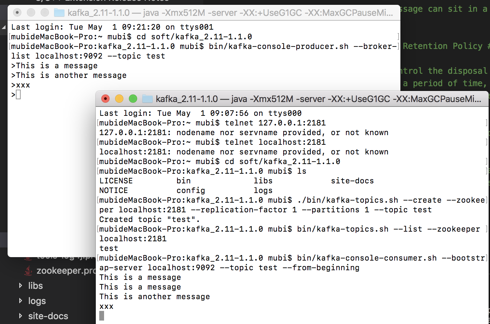
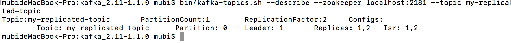
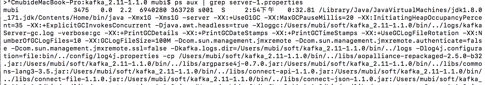
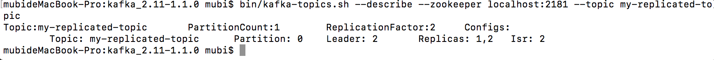
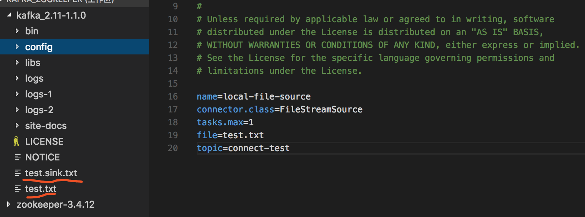
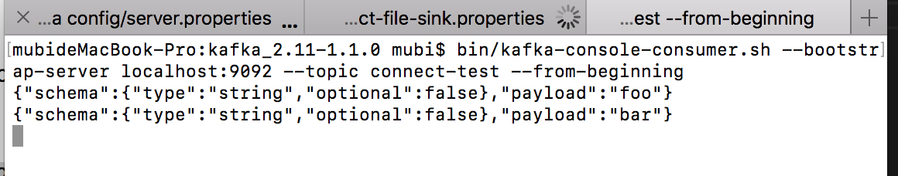

主要基于Linux/Unix系统，这部分按照英文文档，并结合实际操作来介绍，不完全照着文档翻译。

---

Kafka是基于zookeeper的，所以首先要配置zookeeper, 其次是Kafka配置

# zookeeper 单节点配置

conf/zoo.cfg

主要是 dataDir,  dataLogDir, clientPort

```
# The number of milliseconds of each tick
tickTime=2000
# The number of ticks that the initial 
# synchronization phase can take
initLimit=10
# The number of ticks that can pass between 
# sending a request and getting an acknowledgement
syncLimit=5
# the directory where the snapshot is stored.
# do not use /tmp for storage, /tmp here is just 
# example sakes.
dataDir=/Users/mubi/soft/zookeeper-3.4.12/data
dataLogDir=/Users/mubi/soft/zookeeper-3.4.12/logs
# the port at which the clients will connect
clientPort=2181
# the maximum number of client connections.
# increase this if you need to handle more clients
#maxClientCnxns=60
#
# Be sure to read the maintenance section of the 
# administrator guide before turning on autopurge.
#
# http://zookeeper.apache.org/doc/current/zookeeperAdmin.html#sc_maintenance
#
# The number of snapshots to retain in dataDir
#autopurge.snapRetainCount=3
# Purge task interval in hours
# Set to "0" to disable auto purge feature
#autopurge.purgeInterval=1
```

启动zookeeper
```
bin/zkServer start
```

# Kafka配置

## 第一步，Kafka官网下载Kafka release包, 并解压

```
tar -xzf kafka_2.11-1.1.0.tgz
cd kafka_2.11-1.1.0
```

## 第二步，启动Kafka服务端

```
bin/kafka-server-start.sh config/server.properties
```

kafka 的 server.properties 中
```
# The id of the broker. This must be set to a unique integer for each broker.
broker.id=0

# The address the socket server listens on. It will get the value returned from 
# java.net.InetAddress.getCanonicalHostName() if not configured.
#   FORMAT:
#     listeners = listener_name://host_name:port
#   EXAMPLE:
#     listeners = PLAINTEXT://your.host.name:9092
#listeners=PLAINTEXT://:9092

# A comma separated list of directories under which to store log files
log.dirs=/Users/mubi/soft/kafka_2.11-1.1.0/logs
```

kafka 配置文件默认使用zookeeper 2181 端口

## 第三步，创建topic

创建一个名称为： test 的 topic
```
bin/kafka-topics.sh --create --zookeeper localhost:2181 --replication-factor 1 --partitions 1 --topic test
```

查看topic 可使用如下的命令

```
bin/kafka-topics.sh --list --zookeeper localhost:2181
```


## 第四步，服务端发送消息

直接在控制台上输入任意的字符串消息

```
bin/kafka-console-producer.sh --broker-list localhost:9092 --topic test
This is a message
This is another message
xxx
```

## 第五步，客户端接收消息

消费者消费上述服务端的消息

```
bin/kafka-console-consumer.sh --bootstrap-server localhost:9092 --topic test --from-beginning
```

当服务端不断的发送数据时，客户端能不断的显示接收到的消息

运行截图如下


---

# Kafka多broker配置

## 创建server.properties

```
cp config/server.properties config/server-1.properties

cp config/server.properties config/server-2.properties
```

修改其中的内容

config/server-1.properties:
```
    broker.id=1
    listeners=PLAINTEXT://:9093
    log.dir=/tmp/kafka-logs-1
```

config/server-2.properties:
```
    broker.id=2
    listeners=PLAINTEXT://:9094
    log.dir=/tmp/kafka-logs-2
```

## 仍然开启zookeeper单节点
```
mubideMacBook-Pro:zookeeper-3.4.12 mubi$ bin/zkServer.sh start
ZooKeeper JMX enabled by default
Using config: /Users/mubi/soft/zookeeper-3.4.12/bin/../conf/zoo.cfg
Starting zookeeper ... STARTED
```


## 接着开启kafka服务
```
bin/kafka-server-start.sh config/server.properties &

bin/kafka-server-start.sh config/server-1.properties &

bin/kafka-server-start.sh config/server-2.properties &
```

## 创建 topic
```
bin/kafka-topics.sh --create --zookeeper localhost:2181 --replication-factor 2 --partitions 1 --topic my-replicated-topic
```


## 查看topic的broker情况

```
bin/kafka-topics.sh --describe --zookeeper localhost:2181 --topic my-replicated-topic
```



对于 test topic查看
```
bin/kafka-topics.sh --describe --zookeeper localhost:2181 --topic test

Topic:test	PartitionCount:1	ReplicationFactor:1	Configs:
Topic: test	Partition: 0	Leader: 0	Replicas: 0	Isr: 0
```

### leader
"leader" is the node responsible for all reads and writes for the given partition. Each node will be the leader for a randomly selected portion of the partitions.

### replicas
"replicas" is the list of nodes that replicate the log for this partition regardless of whether they are the leader or even if they are currently alive.

### isr
"isr" is the set of "in-sync" replicas. This is the subset of the replicas list that is currently alive and caught-up to the leader.


## 服务端，客户端 控制台消息测试

```
bin/kafka-console-producer.sh --broker-list localhost:9092 --topic my-replicated-topic
```

```
bin/kafka-console-consumer.sh --bootstrap-server localhost:9092 --from-beginning --topic my-replicated-topic
```

----

# 容错测试

名称为my-replicated-topic的topic的leader是 broker 1 ，备份是 broker 2

```
Topic:my-replicated-topic	PartitionCount:1	ReplicationFactor:2	Configs:
Topic: my-replicated-topic	Partition: 0	Leader: 1	Replicas: 1,2	Isr: 1,2
```

```
ps aux | grep server-1.properties

# 杀死上述进程
kill -9 pid
```
接着查看 leader 自动变成了2，consumer依然能正常访问得到消息





----

# 利用 Kafka Connect 工具进行数据的导入/导出数据

Writing data from the console and writing it back to the console is a convenient place to start, but you'll probably want to use data from other sources or export data from Kafka to other systems. For many systems, instead of writing custom integration code you can use Kafka Connect to import or export data.

Kafka Connect is a tool included with Kafka that imports and exports data to Kafka. It is an extensible tool that runs connectors, which implement the custom logic for interacting with an external system. In this quickstart we'll see how to run Kafka Connect with simple connectors that import data from a file to a Kafka topic and export data from a Kafka topic to a file.

kafka利用Connector工具来接入外部数据源，如下是一个简单的测试

1. 启动zookeeper, kafka server并创建一个topic

```
bin/zookeeper-server-start.sh config/zookeeper.properties

bin/kafka-server-start.sh config/server.properties

bin/kafka-topics.sh --create --zookeeper localhost:2181 --replication-factor 1 --partitions 1 --topic connect-test
Created topic "connect-test"
```

2. connector 配置

* kafka目录下新建 test.txt 文件
```
echo foo> test.txt
echo bar>> test.txt
```

* connect-file-source.properties 
```
name=local-file-source
connector.class=FileStreamSource
tasks.max=1
file=test.txt
```

* connect-file-sink.properties 
```
name=local-file-sink
connector.class=FileStreamSink
tasks.max=1
file=test.sink.txt
```

* 启动 connector,查看sink文件的生成

```
bin/connect-standalone.sh config/connect-standalone.properties config/connect-file-source.properties config/connect-file-sink.properties
```



3. 客户端验证

```
bin/kafka-console-consumer.sh --bootstrap-server localhost:9092 --topic connect-test --from-beginning
```




---